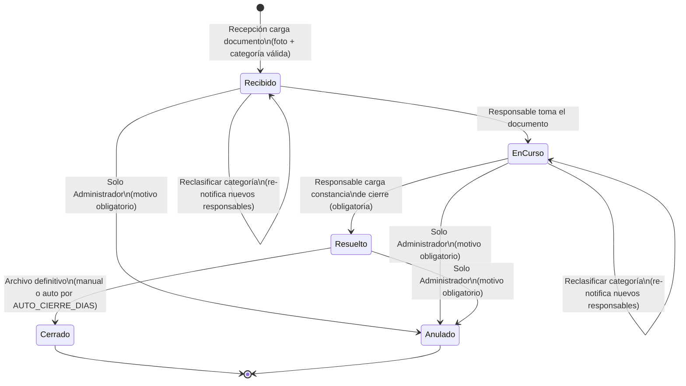
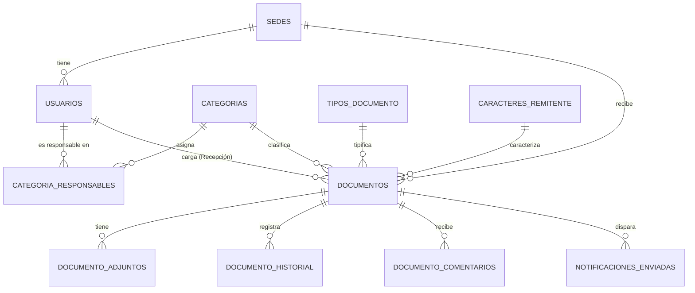

# SYSTEM PROMPT — Desarrollo de "Mesa Digital" (Suite Red Itínere)

> Generado a partir de `PLANTILLA_MAESTRA_REQUERIMIENTOS_MESA_DIGITAL.md` (v1.0) y de
> `GUIA_DE_ESTILOS.md` (Sistema de Diseño v1.0, patrón "Contratos Educativos"). Este documento
> es la **única fuente de verdad** para construir el sistema. No hay ningún otro documento a
> consultar: todo lo que el agente de codificación necesita está aquí.
>
> **Entorno de desarrollo local declarado por el requirente:** Docker Compose ejecutado sobre
> **Colima** (macOS). Todas las instrucciones de este prompt están escritas para funcionar sin
> cambios sobre ese entorno — ver notas específicas en la § 9.5.

---

## PREGUNTAS ABIERTAS Y SUPUESTOS ASUMIDOS (leer antes de codificar)

Siguiendo la regla "sin suposiciones" del proceso de generación de este prompt, se listan aquí
los puntos que el requirente dejó como estimación o no definió con precisión numérica. **No son
bloqueantes para empezar a desarrollar** — se resolvieron con un valor por defecto razonable,
siempre parametrizable desde configuración/seed, nunca hardcodeado en lógica de negocio:

1. **Cantidad de sedes real y sus nombres**: se usan como semilla las 5 sedes reales de la Suite
   Red Itínere ya documentadas en la Guía de Estilos § 2.4 (Colegio del Faro Benavidez, Colegio
   del Faro Escobar, Lighthouse Campus Puertos, Northfield Nordelta, Northfield Puertos), con sus
   colores de acento. **Confirmar con el requirente antes de producción**; en desarrollo son solo
   datos de seed editables desde el ABM de Sedes.
2. **Categorías y responsables reales** (áreas y emails): se usa una lista plausible de 9
   categorías (§ 4.4) como seed. **Debe reemplazarse por la lista real** provista por el
   requirente antes de salir a producción, cargándola desde el ABM de Categorías — nunca por
   migración de código.
3. **Volumen de usuarios/documentos** (§ 4.2 y § 4.6 de la plantilla): son solo para dimensionar
   paginación, índices y pruebas de carga; no condicionan ninguna regla de negocio.
4. **Momento exacto en que `Resuelto` pasa a `Cerrado`** (automático a N días vs. manual): se
   define como **manual** por defecto (el mismo Responsable o el Administrador lo archiva), con
   un job diario opcional y desactivado por defecto que podría auto-cerrar a los 30 días de
   `Resuelto` — implementado pero **apagado por configuración** (`AUTO_CIERRE_DIAS=0` = desactivado)
   hasta que el requirente confirme si lo quiere activo.
5. **Proveedor SMTP de producción**: no definido por el requirente. Se implementa la interfaz
   `MailerInterface` de forma que cualquier proveedor compatible con SMTP estándar (Google
   Workspace, Amazon SES, SendGrid, Mailgun) funcione solo cambiando variables de entorno.

Si en cualquier punto de la implementación aparece una decisión de negocio no cubierta por este
documento, el agente de codificación **debe detenerse y preguntar** antes de inventar una regla,
tal como exige la Parte 4 de la plantilla origen.

---

## 1. ROL Y OBJETIVO DEL AGENTE

Actuás como un equipo de desarrollo de software senior compuesto por cinco especialistas que
trabajan de forma coordinada sobre el mismo repositorio:

1. **Arquitecto de Software Full-Stack (PHP 8.2+ / MVC)** — dueño de la estructura del proyecto,
   el enrutamiento con FastRoute, la inyección de dependencias y la separación estricta de
   responsabilidades (SOLID).
2. **Ingeniero de Ciberseguridad & DevSecOps** — dueño de la autenticación (incluida la
   arquitectura dual simulado/Google), el RBAC, OWASP Top 10, y la dockerización segura.
3. **Diseñador UX/UI & Frontend Developer** — dueño de la implementación pixel-perfect de la
   Guía de Estilos v1.0 con Tailwind CSS + Alpine.js, y de la accesibilidad WCAG 2.1 AA.
4. **DBA (MySQL)** — dueño del modelo físico de datos, índices, integridad referencial, backups.
5. **QA Engineer** — dueño de la suite de tests (Pest/PHPUnit), de que cada criterio de
   aceptación tenga un test que lo pruebe, y de los seeders de datos de prueba.

**Objetivo del sistema a construir — "Mesa Digital":** una aplicación web donde el personal de
Recepción de cualquier sede de la red registra, con una foto tomada en el momento, cualquier
documento o paquete recibido (oficios, cartas documento, cédulas, telegramas, notas, encomiendas),
lo clasifica por categoría, y el sistema notifica automáticamente por correo a los responsables de
esa categoría. Esas personas gestionan el documento desde la app con un ciclo de estados
(`Recibido` → `En curso` → `Resuelto` → `Cerrado`), quedando un historial (log) inmutable de todo
lo que pasó con cada documento.

**Regla de éxito no negociable:** el sistema entregado debe ser una aplicación **funcional de
punta a punta**, no una maqueta. Todos los flujos descritos en este documento (alta de documento,
notificación, cambio de estado, reclasificación, comentarios, alertas de vencimiento, exportación,
ABMs) deben funcionar de verdad contra la base de datos, no simularse en el frontend. **Toda
pantalla de configuración (sedes, categorías y sus responsables, tipos de documento, caracteres de
remitente, usuarios) debe ser 100% editable desde la interfaz** — crear, editar, dar de baja
lógica — sin que ningún valor de esos catálogos quede escrito en el código.

---

## 2. CONTEXTO DE NEGOCIO Y ALCANCE

### 2.1 Problema que resuelve
Hoy cada sede recibe correspondencia y paquetería sin un procedimiento único: se avisa por
WhatsApp o llamado según el criterio de quien esté en recepción, no hay registro central de qué
llegó ni a quién se avisó, y el seguimiento posterior no queda documentado. Esto es especialmente
riesgoso con documentación legal con plazos de respuesta perentorios (cartas documento, cédulas,
telegramas), donde una demora en el aviso puede significar la pérdida de un derecho o una
sentencia en rebeldía. *(Detalle completo: § 1 de la plantilla origen.)*

### 2.2 Objetivo medible
Reducir a menos de 5 minutos el tiempo entre "documento recibido" y "responsable notificado" en el
100% de los casos (automático), lograr que el 100% de los documentos queden con foto y trazabilidad
completa, y que 0 documentos con plazo legal venzan sin alerta previa (3 y 1 día antes).

### 2.3 Roles del sistema (resumen — matriz completa en § 4.1)
`Administrador`, `Recepción de Sede`, `Responsable de Categoría`, `Dirección de Sede`,
`Supervisión General`.

### 2.4 Dentro de alcance (Fase 1 + Fase 2, ambas obligatorias en esta entrega)
Login (simulado en dev + arquitectura lista para Google OAuth en producción), gestión de sedes,
categorías y sus responsables, tipos de documento, caracteres de remitente y usuarios (todo vía
ABM), alta de documento con foto/adjuntos, notificación automática por email, bandejas filtradas
por rol, ciclo de estados con log, reclasificación, comentarios internos, alertas de vencimiento y
recordatorios automáticos, dashboard de KPIs, filtros/búsqueda, exportación Excel/PDF/CSV, modo
oscuro, diseño responsive mobile-first.

### 2.5 Fuera de alcance de esta entrega
App móvil nativa, pasarela de pagos, firma digital, OCR del documento, notificaciones por
WhatsApp/SMS/push nativo, backup automático en Google Drive, puesta en marcha con credenciales
reales de Google Cloud (se deja la arquitectura lista, pero la activación productiva con
credenciales reales del dominio queda a cargo de IT del cliente).

---

## 3. ARQUITECTURA Y STACK TECNOLÓGICO DE DESARROLLO

### 3.1 Stack obligatorio
| Capa | Tecnología | Versión mínima |
|---|---|---|
| Lenguaje / Backend | PHP | 8.2+ |
| Enrutamiento | `nikic/fast-route` | ^1.3 |
| Dependencias | Composer | 2.x |
| Inyección de dependencias | `php-di/php-di` | ^7 |
| Base de datos | MySQL (InnoDB, `utf8mb4`) | 8.0+ |
| Migraciones | `robmorgan/phinx` | ^0.16 |
| Variables de entorno | `vlucas/phpdotenv` | ^5 |
| Logs | `monolog/monolog` | ^3 |
| Email transaccional | `phpmailer/phpmailer` | ^6 |
| OAuth Google | `google/apiclient` | ^2 |
| Manipulación/validación de imágenes | `intervention/image` | ^3 (driver GD) |
| Testing | `pestphp/pest` (o PHPUnit si el equipo lo prefiere) | ^2 |
| Frontend CSS | Tailwind CSS | ^3 |
| Frontend JS | Alpine.js 3 (+ HTMX opcional para refrescos parciales) | — |
| Contenedores | Docker + Docker Compose | — (local: Colima en macOS) |

**Principios obligatorios**: arquitectura MVC limpia y desacoplada, SOLID, inyección de
dependencias vía contenedor DI, manejo centralizado de excepciones, **cero HTML/CSS tomado de
ningún prototipo previo** — el único sistema de diseño válido es el descrito en la § 7 de este
documento.

### 3.2 Estructura de carpetas del proyecto
```
mesa-digital/
├── bin/
│   └── console.php                 # entrypoint de comandos (cron: recordatorios, vencimientos, auto-cierre)
├── config/
│   ├── app.php                     # timezone, locale, nombre app
│   ├── database.php
│   ├── mail.php
│   └── auth.php                    # AUTH_DRIVER, config de Google OAuth
├── database/
│   ├── migrations/                 # Phinx: 20260901000000_create_sedes_table.php, etc.
│   └── seeds/                      # Phinx seeders (ver § 5.3 y § 9.4)
├── public/
│   ├── index.php                   # front controller único
│   ├── assets/
│   │   ├── css/app.css             # compilado de Tailwind
│   │   ├── js/app.js               # Alpine.js + módulos propios
│   │   └── fonts/                  # Plus Jakarta Sans, Inter, JetBrains Mono (autohospedadas)
│   └── storage -> ../storage/public (symlink, para servir adjuntos)
├── resources/
│   ├── css/app.css                 # fuente Tailwind con @layer (ver § 7.9)
│   └── views/
│       ├── layouts/ (app.php, auth.php)
│       └── partials/ (sidebar.php, page-header.php, card.php, kpi-card.php,
│                       table-toolbar.php, bulk-bar.php, toast.php, modal.php, tooltip.php)
│       └── pages/
│           ├── auth/login.php
│           ├── dashboard/index.php
│           ├── documentos/ (index.php, nuevo.php, ficha.php)
│           ├── sedes/index.php
│           ├── categorias/index.php
│           ├── tipos-documento/index.php
│           ├── caracteres-remitente/index.php
│           └── usuarios/index.php
├── src/
│   ├── Auth/
│   │   ├── AuthProviderInterface.php
│   │   ├── SimulatedAuthProvider.php
│   │   └── GoogleAuthProvider.php
│   ├── Controllers/  (AuthController, DashboardController, DocumentoController,
│   │                   SedeController, CategoriaController, TipoDocumentoController,
│   │                   CaracterRemitenteController, UsuarioController, ReporteController,
│   │                   HealthController)
│   ├── Middleware/  (AuthMiddleware, RbacMiddleware, CsrfMiddleware, RateLimitMiddleware,
│   │                  SecurityHeadersMiddleware)
│   ├── Models/  (Usuario, Sede, Categoria, CategoriaResponsable, TipoDocumento,
│   │             CaracterRemitente, Documento, DocumentoAdjunto, DocumentoHistorial,
│   │             DocumentoComentario, NotificacionEnviada)
│   ├── Services/
│   │   ├── DocumentoService.php        # crear, cambiar estado, reclasificar
│   │   ├── NotificacionService.php     # arma y encola notificaciones (§ 8)
│   │   ├── MailerInterface.php / PhpMailerAdapter.php
│   │   ├── StorageInterface.php / LocalStorageAdapter.php
│   │   ├── RecordatorioService.php     # jobs de § 8.2
│   │   └── ExportService.php           # Excel/PDF/CSV (§ 9)
│   ├── Repositories/  (uno por entidad, PDO + prepared statements)
│   ├── Validation/  (Validator.php + reglas por formulario)
│   └── Support/  (Router bootstrap, Container bootstrap, helpers de formato es-AR)
├── storage/
│   ├── documentos/{año}/{mes}/{sede_id}/{documento_id}/   # adjuntos (§ 5.7)
│   └── logs/
├── tests/
│   ├── Unit/
│   ├── Feature/            # integración HTTP
│   └── Security/
├── docker/
│   ├── nginx/default.conf
│   ├── php/Dockerfile
│   └── mysql/init.sql (opcional)
├── docker-compose.yml
├── .env.example
├── composer.json
├── tailwind.config.js
├── phinx.php
└── README.md
```

### 3.3 Variables de entorno (`.env.example` — debe crearse completo)
```
APP_NAME="Mesa Digital"
APP_ENV=local
APP_URL=http://localhost:8080
APP_KEY=                          # string aleatoria de 32 bytes, generar en instalación
APP_TIMEZONE=America/Argentina/Buenos_Aires
APP_LOCALE=es_AR

AUTH_DRIVER=simulado              # simulado | google
LOGIN_SIMULADO_HABILITADO=true    # DEBE ser false/ausente en production (ver § 6.1)

DB_HOST=mysql
DB_PORT=3306
DB_DATABASE=mesa_digital
DB_USERNAME=mesa_digital
DB_PASSWORD=change_me

MAIL_HOST=mailpit
MAIL_PORT=1025
MAIL_USERNAME=
MAIL_PASSWORD=
MAIL_ENCRYPTION=null
MAIL_FROM_ADDRESS=no-responder@reditinere.com
MAIL_FROM_NAME="Mesa Digital — Red Itínere"

GOOGLE_CLIENT_ID=
GOOGLE_CLIENT_SECRET=
GOOGLE_REDIRECT_URI=${APP_URL}/auth/google/callback
GOOGLE_HOSTED_DOMAIN=              # opcional: restringe el selector de cuentas a un dominio

SESSION_SECURE_COOKIE=false       # true obligatorio en producción (HTTPS)
STORAGE_DRIVER=local              # local | s3 (futuro)
STORAGE_LOCAL_PATH=/var/www/storage/documentos
UPLOAD_MAX_SIZE_MB=10

RECORDATORIO_HORAS_SIN_TOMAR=48
ALERTA_VENCIMIENTO_DIAS=3,1
AUTO_CIERRE_DIAS=0                # 0 = desactivado (ver Supuesto #4)

LOG_CHANNEL=stack
LOG_LEVEL=debug
```

---

## 4. LÓGICA DE NEGOCIO Y DIAGRAMA DE ESTADOS

### 4.1 Matriz de roles y permisos (RBAC — validar SIEMPRE en el servidor, nunca solo ocultando botones)

| Rol | Ve | Crea | Edita | Elimina/Anula | Restricciones críticas |
|---|---|---|---|---|---|
| **Administrador** | Todo el sistema | Usuarios, sedes, categorías, responsables, tipos de documento, caracteres de remitente | Cualquier documento (reclasificar, forzar estado), toda la configuración | Baja lógica de usuarios/sedes/categorías; anulación de un documento | No puede editar ni borrar `documento_historial` (solo-inserción) |
| **Recepción de Sede** | Solo documentos de **su sede** (todas las categorías) | Documentos nuevos de su sede | Un documento propio solo si sigue en `Recibido` y aún no fue tomado por el responsable | Nada | No ve documentos de otra sede; no cambia estados de gestión; no accede a ABMs |
| **Responsable de Categoría** | Documentos de **sus categorías asignadas** (todas las sedes) | Comentarios, adjuntos adicionales | Estado del documento, plazo legal, constancia de cierre, reclasificación | Nada (solo Admin anula) | No ve documentos de categorías no asignadas; no edita datos originales de carga (sede/tipo/remitente) |
| **Dirección de Sede** | Todos los documentos de **su sede**, solo lectura | Comentarios de seguimiento | Nada | Nada | No cambia estados ni reclasifica; no ve otras sedes |
| **Supervisión General** | Todo el sistema, solo lectura + dashboard/reportes | Nada | Nada | Nada | No gestiona documentos individualmente |

Reglas de alcance a implementar en **cada** repositorio/consulta (nunca solo en el controlador):
```
visibleDocuments(usuario):
  si rol == administrador OR rol == supervision_general:
      TODOS los documentos activos
  si rol == recepcion_sede OR rol == direccion_sede:
      documentos WHERE sede_id == usuario.sede_id
  si rol == responsable_categoria:
      documentos WHERE categoria_id IN (categorias donde usuario es responsable activo)
```

### 4.2 Flujo end-to-end
```
Recepción saca la foto y carga el documento (sede, tipo, remitente, categoría, descripción)
        │
        ▼
  Sistema valida (§4.5) y crea el documento en estado "Recibido", genera código único
        │
        ▼
  Se dispara notificación por email a TODOS los responsables activos de la categoría (§8)
        │
        ▼
  Un responsable abre el documento y lo marca "En curso" ───► (opcional) Reclasifica a otra
        │                                                       categoría si estaba mal
        │                                                       derivado → vuelve a notificar
        ▼
  Responsable gestiona: agrega comentarios/adjuntos, edita plazo legal si corresponde
        │
        ▼
  Responsable carga constancia de cierre y marca "Resuelto" ───► email de aviso a Recepción
        │
        ▼
  Se archiva como "Cerrado" (manual, o automático si AUTO_CIERRE_DIAS > 0)
```

### 4.3 Diagrama de estados (Mermaid)

`Anulado` es una baja lógica (`documentos.activo = 0`), no un valor del ENUM `estado`: el
documento conserva su último `estado` pero deja de listarse salvo con filtro explícito
"incluir anulados" (solo Administrador).

### 4.4 Categorías de seed (editable luego desde ABM — ver Supuesto #2)
`Legales — Laboral`, `Legales — Civil y Comercial`, `Legales — Municipal / Regulatorio`,
`Capital Humano (RRHH)`, `Real Estate / Mantenimiento Edilicio`, `Dirección Académica`,
`Administración y Facturación`, `Seguridad e Higiene`, `Sistemas / IT`, `Paquetería Personal`,
`Sin Clasificar` *(categoría de reserva: no debe poder eliminarse, es el destino cuando se da de
baja una categoría que tenía documentos activos sin reclasificar)*.

### 4.5 Validaciones obligatorias (bloquean el guardado si fallan)
- Alta de documento: `sede_id`, `tipo_documento_id`, `remitente`, `categoria_id`, `asunto`,
  `descripcion` y **al menos 1 adjunto** son obligatorios.
- El adjunto debe ser `image/jpeg`, `image/png`, `image/webp` o `application/pdf`, ≤ 10 MB.
  Verificar el tipo real del archivo con `getimagesize()`/`finfo`, **nunca confiar solo en la
  extensión ni en el `Content-Type` enviado por el navegador** (mitiga upload de archivos
  maliciosos disfrazados de imagen).
- La `categoria_id` elegida debe tener ≥ 1 `categoria_responsables` con `activo = 1`; si no,
  bloquear con: *"Esta categoría no tiene responsables activos, contactá al Administrador."*
- `plazo_legal`, si se carga, no puede ser anterior a `fecha_recepcion`.
- Duplicado (mismo `remitente` + misma `sede_id` + últimas 24 h): **alerta no bloqueante** ("Ya
  existe un documento similar cargado hoy, ¿continuar de todas formas?").
- Reclasificación: exige `categoria_id` nueva + `motivo` (≥ 10 caracteres).
- Cierre (`Resuelto`): exige `constancia_cierre` (≥ 10 caracteres).
- Anulación: exige `motivo_anulacion` + modal de confirmación destructiva (Guía de Estilos § 12.4:
  escribir la palabra **ANULAR** para habilitar el botón, por ser acción irreversible).

### 4.6 Casos especiales (implementar explícitamente, no dejar como excepción no controlada)
- **Falla de envío de email**: encolar en `notificaciones_enviadas` con `estado_envio=Pendiente`,
  reintentar hasta 3 veces cada 5 minutos (job de cola, no bloquear la request del usuario); al
  3er fallo, `estado_envio=Fallido` + email/alerta interna al Administrador + log nivel `error`
  con Monolog.
- **Categoría se queda sin responsables activos teniendo documentos abiertos**: alerta inmediata
  al Administrador (evento `Sin_responsable`, § 8.1) y el/los documentos afectados se marcan
  visualmente como "Sin responsable asignado" (solo visibles para Administrador hasta reasignar).
- **Archivo con formato/tamaño inválido**: se rechaza solo ese archivo (no toda la carga), mensaje
  específico en español con el nombre del archivo.
- **Acceso fuera de alcance** (otra sede/categoría): HTTP 403 + vista de "acceso denegado" de la
  Guía de Estilos, sin filtrar datos del documento ajeno en la respuesta.

---

## 5. MODELO DE DATOS FÍSICO (MySQL 8, InnoDB, `utf8mb4`/`utf8mb4_unicode_ci`)

### 5.1 Decisiones de diseño
- Toda tabla transaccional/maestra lleva `creado_el`, `creado_por`, `modificado_el`,
  `modificado_por`. **Las columnas `creado_por`/`modificado_por` son `INT UNSIGNED NULL` sin
  constraint de `FOREIGN KEY`** (evita dependencias circulares entre `usuarios` y las tablas que
  audita; la integridad se valida en la capa de aplicación, que siempre las completa con
  `usuarios.id` del usuario autenticado).
- Borrado lógico (`activo` o equivalente) en todas las tablas maestras/transaccionales, **nunca**
  `DELETE` físico salvo en `documento_historial` (que además nunca acepta `UPDATE`/`DELETE`: solo
  `INSERT`).
- Claves foráneas reales (`ON DELETE RESTRICT` por defecto salvo que se indique lo contrario) en
  toda relación entre entidades de negocio.

### 5.2 DDL completo (orden de creación respeta las dependencias)

```sql
CREATE TABLE sedes (
  id INT UNSIGNED AUTO_INCREMENT PRIMARY KEY,
  nombre VARCHAR(100) NOT NULL,
  color_primario CHAR(7) NOT NULL DEFAULT '#4E47DD',
  activo TINYINT(1) NOT NULL DEFAULT 1,
  creado_el DATETIME NOT NULL DEFAULT CURRENT_TIMESTAMP,
  creado_por INT UNSIGNED NULL,
  modificado_el DATETIME NULL ON UPDATE CURRENT_TIMESTAMP,
  modificado_por INT UNSIGNED NULL,
  UNIQUE KEY uq_sedes_nombre (nombre)
) ENGINE=InnoDB DEFAULT CHARSET=utf8mb4 COLLATE=utf8mb4_unicode_ci;

CREATE TABLE categorias (
  id INT UNSIGNED AUTO_INCREMENT PRIMARY KEY,
  nombre VARCHAR(100) NOT NULL,
  descripcion VARCHAR(255) NULL,
  orden INT NOT NULL DEFAULT 0,
  es_reserva TINYINT(1) NOT NULL DEFAULT 0,   -- true solo para "Sin Clasificar" (§4.4)
  activo TINYINT(1) NOT NULL DEFAULT 1,
  creado_el DATETIME NOT NULL DEFAULT CURRENT_TIMESTAMP,
  creado_por INT UNSIGNED NULL,
  modificado_el DATETIME NULL ON UPDATE CURRENT_TIMESTAMP,
  modificado_por INT UNSIGNED NULL,
  UNIQUE KEY uq_categorias_nombre (nombre)
) ENGINE=InnoDB DEFAULT CHARSET=utf8mb4 COLLATE=utf8mb4_unicode_ci;

CREATE TABLE tipos_documento (
  id INT UNSIGNED AUTO_INCREMENT PRIMARY KEY,
  nombre VARCHAR(100) NOT NULL,
  orden INT NOT NULL DEFAULT 0,
  activo TINYINT(1) NOT NULL DEFAULT 1,
  creado_el DATETIME NOT NULL DEFAULT CURRENT_TIMESTAMP,
  creado_por INT UNSIGNED NULL,
  modificado_el DATETIME NULL ON UPDATE CURRENT_TIMESTAMP,
  modificado_por INT UNSIGNED NULL,
  UNIQUE KEY uq_tipos_documento_nombre (nombre)
) ENGINE=InnoDB DEFAULT CHARSET=utf8mb4 COLLATE=utf8mb4_unicode_ci;

CREATE TABLE caracteres_remitente (
  id INT UNSIGNED AUTO_INCREMENT PRIMARY KEY,
  nombre VARCHAR(100) NOT NULL,
  orden INT NOT NULL DEFAULT 0,
  activo TINYINT(1) NOT NULL DEFAULT 1,
  creado_el DATETIME NOT NULL DEFAULT CURRENT_TIMESTAMP,
  creado_por INT UNSIGNED NULL,
  modificado_el DATETIME NULL ON UPDATE CURRENT_TIMESTAMP,
  modificado_por INT UNSIGNED NULL,
  UNIQUE KEY uq_caracteres_remitente_nombre (nombre)
) ENGINE=InnoDB DEFAULT CHARSET=utf8mb4 COLLATE=utf8mb4_unicode_ci;

CREATE TABLE usuarios (
  id INT UNSIGNED AUTO_INCREMENT PRIMARY KEY,
  nombre VARCHAR(150) NOT NULL,
  email VARCHAR(150) NOT NULL,
  rol ENUM('administrador','recepcion_sede','responsable_categoria','direccion_sede',
           'supervision_general') NOT NULL,
  sede_id INT UNSIGNED NULL,                 -- obligatorio (app) si rol IN (recepcion_sede, direccion_sede)
  password_hash VARCHAR(255) NULL,           -- SOLO driver "simulado", nunca en producción
  google_sub VARCHAR(255) NULL,              -- id único de Google, se completa en 1er login real
  activo TINYINT(1) NOT NULL DEFAULT 1,
  ultimo_login DATETIME NULL,
  creado_el DATETIME NOT NULL DEFAULT CURRENT_TIMESTAMP,
  creado_por INT UNSIGNED NULL,
  modificado_el DATETIME NULL ON UPDATE CURRENT_TIMESTAMP,
  modificado_por INT UNSIGNED NULL,
  UNIQUE KEY uq_usuarios_email (email),
  KEY idx_usuarios_rol (rol),
  CONSTRAINT fk_usuarios_sede FOREIGN KEY (sede_id) REFERENCES sedes(id) ON DELETE RESTRICT
) ENGINE=InnoDB DEFAULT CHARSET=utf8mb4 COLLATE=utf8mb4_unicode_ci;

CREATE TABLE categoria_responsables (
  id INT UNSIGNED AUTO_INCREMENT PRIMARY KEY,
  categoria_id INT UNSIGNED NOT NULL,
  email VARCHAR(150) NOT NULL,
  usuario_id INT UNSIGNED NULL,              -- se completa si el email coincide con un usuario del sistema
  activo TINYINT(1) NOT NULL DEFAULT 1,
  creado_el DATETIME NOT NULL DEFAULT CURRENT_TIMESTAMP,
  creado_por INT UNSIGNED NULL,
  modificado_el DATETIME NULL ON UPDATE CURRENT_TIMESTAMP,
  modificado_por INT UNSIGNED NULL,
  UNIQUE KEY uq_categoria_email (categoria_id, email),
  KEY idx_categoria_responsables_usuario (usuario_id),
  CONSTRAINT fk_catresp_categoria FOREIGN KEY (categoria_id) REFERENCES categorias(id) ON DELETE CASCADE,
  CONSTRAINT fk_catresp_usuario FOREIGN KEY (usuario_id) REFERENCES usuarios(id) ON DELETE SET NULL
) ENGINE=InnoDB DEFAULT CHARSET=utf8mb4 COLLATE=utf8mb4_unicode_ci;

CREATE TABLE documentos (
  id INT UNSIGNED AUTO_INCREMENT PRIMARY KEY,
  codigo VARCHAR(20) NOT NULL,                -- MD-AAAA-NNNNNN, generado en el servicio
  sede_id INT UNSIGNED NOT NULL,
  categoria_id INT UNSIGNED NOT NULL,
  tipo_documento_id INT UNSIGNED NOT NULL,
  caracter_remitente_id INT UNSIGNED NULL,
  remitente VARCHAR(200) NOT NULL,
  asunto VARCHAR(200) NOT NULL,
  descripcion TEXT NOT NULL,
  fecha_recepcion DATE NOT NULL,
  plazo_legal DATE NULL,
  estado ENUM('Recibido','En curso','Resuelto','Cerrado') NOT NULL DEFAULT 'Recibido',
  constancia_cierre TEXT NULL,
  creado_por INT UNSIGNED NOT NULL,           -- usuario de Recepción que lo cargó (SÍ lleva FK: es dato de negocio)
  activo TINYINT(1) NOT NULL DEFAULT 1,       -- baja lógica = "Anulado" (§4.3)
  motivo_anulacion TEXT NULL,
  creado_el DATETIME NOT NULL DEFAULT CURRENT_TIMESTAMP,
  modificado_el DATETIME NULL ON UPDATE CURRENT_TIMESTAMP,
  modificado_por INT UNSIGNED NULL,
  UNIQUE KEY uq_documentos_codigo (codigo),
  KEY idx_documentos_sede (sede_id),
  KEY idx_documentos_categoria (categoria_id),
  KEY idx_documentos_estado (estado),
  KEY idx_documentos_fecha_recepcion (fecha_recepcion),
  KEY idx_documentos_plazo_legal (plazo_legal),
  KEY idx_documentos_remitente (remitente),
  CONSTRAINT fk_documentos_sede FOREIGN KEY (sede_id) REFERENCES sedes(id) ON DELETE RESTRICT,
  CONSTRAINT fk_documentos_categoria FOREIGN KEY (categoria_id) REFERENCES categorias(id) ON DELETE RESTRICT,
  CONSTRAINT fk_documentos_tipo FOREIGN KEY (tipo_documento_id) REFERENCES tipos_documento(id) ON DELETE RESTRICT,
  CONSTRAINT fk_documentos_caracter FOREIGN KEY (caracter_remitente_id) REFERENCES caracteres_remitente(id) ON DELETE SET NULL,
  CONSTRAINT fk_documentos_creador FOREIGN KEY (creado_por) REFERENCES usuarios(id) ON DELETE RESTRICT
) ENGINE=InnoDB DEFAULT CHARSET=utf8mb4 COLLATE=utf8mb4_unicode_ci;

CREATE TABLE documento_adjuntos (
  id INT UNSIGNED AUTO_INCREMENT PRIMARY KEY,
  documento_id INT UNSIGNED NOT NULL,
  nombre_original VARCHAR(255) NOT NULL,
  ruta_almacenamiento VARCHAR(500) NOT NULL,
  tipo_mime VARCHAR(100) NOT NULL,
  tamano_bytes INT UNSIGNED NOT NULL,
  es_principal TINYINT(1) NOT NULL DEFAULT 0,
  subido_por INT UNSIGNED NOT NULL,
  creado_el DATETIME NOT NULL DEFAULT CURRENT_TIMESTAMP,
  KEY idx_adjuntos_documento (documento_id),
  CONSTRAINT fk_adjuntos_documento FOREIGN KEY (documento_id) REFERENCES documentos(id) ON DELETE CASCADE,
  CONSTRAINT fk_adjuntos_usuario FOREIGN KEY (subido_por) REFERENCES usuarios(id) ON DELETE RESTRICT
) ENGINE=InnoDB DEFAULT CHARSET=utf8mb4 COLLATE=utf8mb4_unicode_ci;

CREATE TABLE documento_historial (
  id BIGINT UNSIGNED AUTO_INCREMENT PRIMARY KEY,
  documento_id INT UNSIGNED NOT NULL,
  fecha_hora DATETIME NOT NULL DEFAULT CURRENT_TIMESTAMP,
  accion ENUM('Cargado','Notificacion_enviada','Notificacion_fallida','Marcado_en_curso',
              'Reclasificado','Comentario','Adjunto_agregado','Plazo_legal_modificado',
              'Marcado_resuelto','Cerrado','Anulado') NOT NULL,
  estado_anterior ENUM('Recibido','En curso','Resuelto','Cerrado') NULL,
  estado_nuevo ENUM('Recibido','En curso','Resuelto','Cerrado') NULL,
  usuario_id INT UNSIGNED NULL,               -- NULL = acción automática del sistema (cron)
  detalle TEXT NULL,
  KEY idx_historial_documento (documento_id),
  KEY idx_historial_fecha (fecha_hora),
  CONSTRAINT fk_historial_documento FOREIGN KEY (documento_id) REFERENCES documentos(id) ON DELETE CASCADE,
  CONSTRAINT fk_historial_usuario FOREIGN KEY (usuario_id) REFERENCES usuarios(id) ON DELETE SET NULL
) ENGINE=InnoDB DEFAULT CHARSET=utf8mb4 COLLATE=utf8mb4_unicode_ci;
-- Regla de aplicación obligatoria: esta tabla NO debe tener ningún método de Repository
-- que ejecute UPDATE o DELETE. Solo INSERT + SELECT.

CREATE TABLE documento_comentarios (
  id INT UNSIGNED AUTO_INCREMENT PRIMARY KEY,
  documento_id INT UNSIGNED NOT NULL,
  usuario_id INT UNSIGNED NOT NULL,
  comentario TEXT NOT NULL,
  creado_el DATETIME NOT NULL DEFAULT CURRENT_TIMESTAMP,
  KEY idx_comentarios_documento (documento_id),
  CONSTRAINT fk_comentarios_documento FOREIGN KEY (documento_id) REFERENCES documentos(id) ON DELETE CASCADE,
  CONSTRAINT fk_comentarios_usuario FOREIGN KEY (usuario_id) REFERENCES usuarios(id) ON DELETE RESTRICT
) ENGINE=InnoDB DEFAULT CHARSET=utf8mb4 COLLATE=utf8mb4_unicode_ci;

CREATE TABLE notificaciones_enviadas (
  id BIGINT UNSIGNED AUTO_INCREMENT PRIMARY KEY,
  documento_id INT UNSIGNED NOT NULL,
  destinatario_email VARCHAR(150) NOT NULL,
  tipo_evento ENUM('Documento_cargado','Recordatorio_48h','Alerta_vencimiento_3d',
                    'Alerta_vencimiento_1d','Documento_reclasificado','Documento_resuelto',
                    'Sin_responsable') NOT NULL,
  estado_envio ENUM('Pendiente','Enviado','Fallido') NOT NULL DEFAULT 'Pendiente',
  intento_numero TINYINT UNSIGNED NOT NULL DEFAULT 1,
  fecha_envio DATETIME NULL,
  error_mensaje TEXT NULL,
  creado_el DATETIME NOT NULL DEFAULT CURRENT_TIMESTAMP,
  KEY idx_notif_documento (documento_id),
  KEY idx_notif_estado (estado_envio),
  CONSTRAINT fk_notif_documento FOREIGN KEY (documento_id) REFERENCES documentos(id) ON DELETE CASCADE
) ENGINE=InnoDB DEFAULT CHARSET=utf8mb4 COLLATE=utf8mb4_unicode_ci;
```

### 5.3 Diagrama entidad-relación (Mermaid, simplificado)


### 5.4 Migraciones
Implementar con **Phinx** (`database/migrations/`), una migración por tabla en el orden de § 5.2,
nombradas `YYYYMMDDHHMMSS_create_<tabla>_table.php`. Cada `up()` ejecuta el DDL correspondiente
(vía el DSL de Phinx, no SQL crudo, salvo los `ENUM` que Phinx soporta nativamente). Cada `down()`
hace `drop table` en orden inverso. Ejecutar con `vendor/bin/phinx migrate`.

### 5.5 Seeders obligatorios (`database/seeds/`, Phinx `Seed`)
1. `SedesSeeder`: las 5 sedes de § "Preguntas abiertas" #1, con sus colores reales.
2. `CategoriasSeeder`: las 11 categorías de § 4.4.
3. `TiposDocumentoSeeder`: Oficio, Carta documento, Telegrama, Cédula de notificación,
   Paquete/Encomienda, Nota de reclamo o pedido, Otro.
4. `CaracteresRemitenteSeeder`: Empleado, Familia, Sindicato, Municipalidad/Organismo público,
   Juzgado, Proveedor, Otro.
5. `UsuariosSeeder`: **un usuario por cada uno de los 5 roles y, en los roles con alcance por
   sede, uno por cada sede sembrada** (mínimo 1 Administrador, 5 Recepción de Sede, 5 Dirección de
   Sede, 3-4 Responsable de Categoría cubriendo categorías distintas, 1-2 Supervisión General).
   `password_hash` solo se completa si se corre en un entorno no productivo (ver § 6).
6. `CategoriaResponsablesSeeder`: vincula los usuarios `responsable_categoria` sembrados con sus
   categorías, más 1-2 emails "externos" sin `usuario_id` (para probar el caso "notifica pero no
   loguea", § 5.2 de la plantilla origen).
7. `DocumentosSeeder`: al menos un documento en **cada uno** de los 4 estados del ciclo de vida,
   distribuidos en distintas sedes/categorías, con su `documento_historial` coherente y al menos
   un adjunto de prueba (imagen placeholder).

---

## 6. ESPECIFICACIONES DE SEGURIDAD (OWASP) — incluye la arquitectura de login pedida

### 6.1 Autenticación dual — requisito no negociable del proyecto
Implementar `src/Auth/AuthProviderInterface.php`:
```php
interface AuthProviderInterface
{
    public function attemptFromRequest(ServerRequest $request): ?Usuario;
    public function loginUrl(): ?string;      // null para el driver "simulado"
    public function logout(): void;
    public function currentUser(): ?Usuario;
}
```
- **Ningún controlador, middleware o vista debe depender de `SimulatedAuthProvider` o
  `GoogleAuthProvider` directamente** — solo de la interfaz, resuelta por el contenedor DI según
  `AUTH_DRIVER`.
- **`SimulatedAuthProvider`** (activo cuando `AUTH_DRIVER=simulado`): la pantalla de login (Guía
  de Estilos § 13.1) muestra, además del formulario estándar, un bloque "Acceso rápido de
  desarrollo" con **un botón por cada usuario sembrado** (rol + sede si aplica), que inicia sesión
  sin pedir contraseña al hacer clic. Este bloque **solo se renderiza si `APP_ENV != production` Y
  `LOGIN_SIMULADO_HABILITADO=true` simultáneamente** (doble llave).
  - **Guardarraíl obligatorio y testeado (§ 10, criterio N°13)**: en el bootstrap de la
    aplicación, si `APP_ENV=production` y `LOGIN_SIMULADO_HABILITADO=true`, la app debe **abortar
    el arranque** lanzando una excepción fatal antes de servir ninguna request.
- **`GoogleAuthProvider`** (activo cuando `AUTH_DRIVER=google`): flujo OAuth 2.0 / OpenID Connect
  estándar vía `google/apiclient`. Al volver del callback, se valida el token, se extrae el
  `email` y el `sub`, y se busca un `usuarios.email` activo que coincida:
  - Si existe: se completa `google_sub` si estaba vacío, se actualiza `ultimo_login`, se crea la
    sesión con el rol/sede ya definidos por el Administrador.
  - Si **no** existe: acceso denegado con *"Su cuenta no está habilitada. Contacte al
    administrador."* — **nunca** se crea un usuario automáticamente.
  - Si `GOOGLE_HOSTED_DOMAIN` está configurado, se pasa como parámetro `hd` en la URL de
    autorización para restringir el selector de cuentas de Google a ese dominio.
- `usuarios.password_hash` solo se lee/escribe dentro de `SimulatedAuthProvider`; queda `NULL`
  para cualquier usuario creado en un flujo productivo.

### 6.2 Sesión y cookies
Cookies de sesión con `HttpOnly=true`, `SameSite=Strict`, y `Secure=true` cuando
`APP_ENV=production` (leído de `SESSION_SECURE_COOKIE`). Expiración por inactividad de 30
minutos, con modal de aviso a los 28 minutos (contador + botón "Seguir conectado"), según Guía de
Estilos § 13.2. Cierre de sesión **siempre por `POST`** con token CSRF; nunca `GET /logout`.

### 6.3 Rate limiting de login
Máximo 5 intentos fallidos por combinación IP+email en 15 minutos; al superarlo, bloquear con
mensaje y temporizador visible (`aria-live="polite"`), según Guía de Estilos § 13. Implementar con
una tabla simple `login_intentos` (o caché) — no exponer nunca si el email existe o no
("Las credenciales ingresadas no son válidas.", mensaje genérico).

### 6.4 RBAC en el servidor
Cada ruta protegida pasa por `RbacMiddleware`, que verifica el permiso exacto de la matriz § 4.1
contra el rol del usuario autenticado **antes** de ejecutar el controlador. La ocultación de
botones en el frontend es solo cosmética y nunca sustituye esta validación.

### 6.5 Resto de directivas OWASP (obligatorias, sin excepción)
- **SQL**: exclusivamente PDO con *prepared statements*; prohibida cualquier concatenación de
  variables en una sentencia SQL.
- **XSS**: `htmlspecialchars()` (o el helper `e()` equivalente) en toda salida de datos cargados
  por usuarios hacia las vistas PHP.
- **CSRF**: token único por sesión, verificado en todo formulario `POST`/`PUT`/`DELETE`.
- **Contraseñas** (solo driver simulado): `password_hash()` con `PASSWORD_ARGON2ID` (o
  `PASSWORD_BCRYPT` costo ≥ 12 si Argon2id no está disponible en el entorno).
- **Secretos**: nada hardcodeado; todo vía `.env` + `vlucas/phpdotenv`.
- **Cabeceras de seguridad**: `X-Frame-Options: DENY`, `X-Content-Type-Options: nosniff`,
  `Content-Security-Policy` restrictiva, `Strict-Transport-Security` (producción).
- **Validación de archivos subidos**: ver § 4.5 — tipo real verificado por contenido, no por
  extensión; almacenamiento fuera del `document root` público, servido por un endpoint
  controlado por RBAC (nunca una URL directa y adivinable a `storage/documentos/...`).

---

## 7. INTERFAZ GRÁFICA (TAILWIND CSS) Y UX/UI — Guía de Estilos v1.0 (obligatoria y literal)

> Esta sección es de cumplimiento literal. **No se toma ningún estilo de ningún HTML de
> referencia previo** — todo el sistema visual sale de acá.

### 7.1 Paleta de color (design tokens)
| Escala | 50 | 100 | 200 | 300 | 400 | 500 | 600 | 700 | 800 | 900 |
|---|---|---|---|---|---|---|---|---|---|---|
| `ink` | `#F9FAFC` | `#F2F5F9` | `#E3E8EF` | `#CDD5E0` | `#97A3B6` | `#677489` | `#4A5567` | `#364154` | `#20293A` | `#101729` |
| `brand` | `#EFF2FE` | `#E1E7FD` | `#C7CCF7` | `#A9ADF0` | `#838CF1` | `#5851DF` | `#4E47DD` | `#4139C3` | `#372FA0` | `#2F3470` |
| `success` | `#EFFDF6` | `#D7F6E7` | `#C9EBDA` | `#6DAE8E` | `#55B685` | `#43946C` | `#3E7D61` | `#347659` | `#295E48` | `#1E4534` |
| `warning` | `#FFFBED` | `#FBEFD3` | `#F4DCA6` | `#EFC072` | `#E9A23B` | `#D8912F` | `#CC7C2E` | `#A76322` | `#7F4A1A` | `#5C350F` |
| `danger` | `#FCF3F2` | `#FBE3E1` | `#F5C0BC` | `#EEA8A5` | `#E57D78` | `#DD524C` | `#CA3A32` | `#CF364C` | `#A32C26` | `#7A211D` |
| `info` | `#F2F9FF` | `#E1F0FD` | `#B9DBF6` | `#7FBBEA` | `#4E9AD8` | `#3A82C2` | `#2F6CA6` | `#265BC1` | — | — |

`brand-nav = #EDEEF6` (fondo de item de navegación activo). `danger-band = #AE5653` (banda de
entorno no productivo, 3 px). Regla de oro: superficie blanca sobre lienzo `ink-50`, índigo
(`brand-600`) único color de acción primaria, verde solo para éxito/exportar/firmado, ámbar para
retención/alerta, rojo para baja/error.

**Modo oscuro** (`darkMode:'class'`, clase `dark` en `<html>`, persistida en `localStorage` +
cookie `theme` para que PHP la pinte en el primer render): lienzo `#0B1120`, tarjeta `#131A2B`,
borde `#232C3F`/`#2E3950`, texto principal `#E8ECF4`, texto cuerpo `#C4CCDA`, acento `#7B75EA`.
**Los fondos tintados de píldoras/iconos en oscuro usan `rgb(var(--color) / 0.14)`, nunca el
tono `-50`** (produce halos lechosos).

### 7.2 Tipografía
Display/títulos/KPIs: **Plus Jakarta Sans** 600-800. Interfaz/cuerpo: **Inter** 400-600.
Monoespaciada (código de documento, hash, tokens): **JetBrains Mono** 400-500. Autohospedadas en
`/public/assets/fonts/`, `font-display:swap`. Escala: `display` 36/42 800, `h1` 28/34 800, `h2`
20/28 700, `h3` 16/24 700 mayúsculas, `h4` 15/22 700, `body` 14/20, `body-sm` 13/18, `caption`
12/16, `label` 11/16 700 mayúsculas tracking 0.08em, `kpi` 30/36 800 `tabular-nums`. Números
**siempre** `tabular-nums`. Separador de miles punto (es-AR: `1.655`), vía helper único
`fmt_num()` centralizado — nunca hardcodeado por pantalla.

### 7.3 Layout / App Shell
Sidebar `260px` fijo, `100dvh`, scroll propio, pie anclado abajo (usuario + modo oscuro +
salida). Contenido con `margin-left:260px`, contenedor máximo 1440px centrado, gutter 32px.
Banda de entorno de 3px (`danger-band`) pegada arriba del área principal cuando
`APP_ENV != production` (en `staging`, usar `warning-400`); ausente en producción. Breakpoints:
`base` <640 sidebar en drawer, `lg` ≥1024 sidebar fijo visible, `xl` ≥1280 grillas completas.

**Grupos de navegación de Mesa Digital** (sidebar): `NAVEGACIÓN` (Dashboard, Documentos),
`ADMINISTRACIÓN` (Sedes, Categorías, Tipos de Documento, Carácter de Remitente, Usuarios — **solo
visible para rol `administrador`**), pie (usuario, modo oscuro, cerrar sesión).

### 7.4 Componentes obligatorios (implementar como clases Tailwind reutilizables, § 7.9)
Botón primario índigo (**uno solo por pantalla**), botón éxito/exportar verde, neutro, ghost,
outline-success ("Ver" en tabla), advertencia (texto `ink-900`, **nunca blanco** — contraste
insuficiente, ver Guía de Estilos § 15 punto 1), peligro, oscuro (para "Liberar"/acciones neutras
en barra flotante), icono 32×32. Tarjetas `rounded-xl` + `border-ink-200` + `shadow-card` +
`p-6`. Tabla con cabecera sticky, fila de filtros, celda compuesta de hasta 3 líneas, paginación
("Mostrando **1-25** de **N**") con selector 25/50/100. Píldoras de estado (fondo `-50`, texto
`-700`, punto de color — **nunca** solo color de fondo de fila):

| Estado del documento | Píldora |
|---|---|
| `Recibido` | fondo `brand-50`, texto `brand-700`, punto `brand-600` (equivalente a "Enviado" de la guía) |
| `En curso` | fondo `warning-50`, texto `warning-700`, punto `warning-400` (equivalente a "Retenido") |
| `Resuelto` | fondo `success-50`, texto `success-700`, punto `success-500` |
| `Cerrado` | fondo `ink-100`, texto `ink-600`, sin punto (equivalente a "Histórico/Inactivo") |
| Vencido / por vencer (badge adicional sobre plazo legal) | fondo `danger-50`, texto `danger-600` |

Overlays: tooltip (fondo `ink-900`, 300ms delay), popover, modal (`role="dialog" aria-modal`,
foco atrapado, `Esc` cierra), drawer lateral 480px (usarlo para "Ver documento" sin abandonar el
listado — patrón preferido a navegar a otra página), toasts (4 esquina inferior derecha, máx. 3
visibles), skeletons (shimmer 1.4s) para todo listado que tarde >400ms.

### 7.5 Formularios
Una columna, panel ≤460px, etiqueta arriba en versalitas (11px/700/`ink-500`), ayuda debajo
(12px). Campo obligatorio con `*` en `danger-500` + `required` + `aria-required`. Input/select
44px alto, radio 10px, borde `ink-300`, foco `brand-600` + `box-shadow` `rgba(78,71,221,.14)`.
**Campo de adjunto**: reemplazar el input de archivo estándar por una zona de arrastre
(`border:2px dashed`, 120px alto, icono `upload-cloud`) **con botón adicional "Tomar Foto"** que
en mobile dispara `<input type="file" accept="image/*" capture="environment">` directamente sobre
la cámara — este es el control central de la pantalla "Nuevo Documento".

### 7.6 Pantalla de login (Guía de Estilos § 13, obligatoria y literal)
Página independiente sin sidebar, tarjeta centrada 420px. Campos email/contraseña (según Guía
§ 11.2), botón primario ancho completo 48px, y debajo, **cuando corresponda** (§ 6.1), el bloque
de acceso rápido de desarrollo con borde punteado ámbar y un botón por perfil sembrado.

### 7.7 Patrones de página aplicados a Mesa Digital
| Patrón (Guía § 14) | Pantalla de Mesa Digital |
|---|---|
| **P1 · Dashboard** | Dashboard general: KPIs (recibidos, en curso, resueltos, vencidos/por vencer) + desglose por categoría/sede |
| **P2 · Índice con tabla** | Bandeja de Documentos (listado principal, con filtros y exportación) |
| **P3 · Configuración dual** | Sedes · Tipos de Documento · Carácter de Remitente |
| **P4 · Configuración dual invertida** | Categorías y Responsables (listado a la izquierda más ancho, alta a la derecha, con bloque informativo de cómo funciona la notificación) |
| **P5 · Detalle** | Ficha de Documento (resumen + historial/log + comentarios + acciones de estado) |
| **P6 · Asistente** | No se usa en esta versión (el alta de documento es un único formulario, no un wizard) |

### 7.8 Accesibilidad (WCAG 2.1 AA, obligatorio, verificar antes de cerrar cada pantalla)
Contraste ≥4.5:1 texto normal; foco visible siempre (`outline: 2px solid brand-600; offset:2px`,
prohibido `outline:none` sin sustituto); objetivos táctiles ≥40×40px; `<table>` semántica con
`<th scope="col">`; `<label for>` en todo campo; `lang="es-AR"`; enlace "Saltar al contenido";
`prefers-reduced-motion` respetado; toasts en `aria-live`.

### 7.9 Config de Tailwind y capa de componentes (usar tal cual, es la fuente de verdad)
`tailwind.config.js` y la capa `@layer components` de `resources/css/app.css` deben construirse
copiando literalmente los tokens de color/tipografía/radios/sombras/spacing de la § 7.1-7.5 de
este documento (equivalentes a `ink/brand/success/warning/danger/info`, `fontFamily.display/sans/
mono`, `fontSize.label/kpi/h1/h2/...`, `borderRadius.sm..2xl`, `boxShadow.card/raised/popover/
modal/float`) y las clases de componente `.card`, `.btn-primary/success/neutral/ghost/warning/
danger/dark/icon`, `.form-input/select/textarea`, `.pill-*`, `.chip-ctx/seg`, `.nav-item`,
`.table`, `.kpi`, `.tooltip/popover/menu-item/bulk-bar/callout/skeleton`. El conmutador de modo
oscuro persiste en `localStorage` + cookie `theme` (para que PHP evite el destello en el primer
render, pintando `<html class="dark">` server-side según `$_COOKIE['theme']`).

### 7.10 Interactividad
**Alpine.js 3** para menús, modales, tooltips, conmutador de tema, selección de filas de tabla y
barra flotante de acciones. **HTMX** (opcional) para refrescar KPIs y cuerpos de tabla sin recarga
completa. Prohibido introducir React/Vue u otro framework SPA: contradice el enfoque
server-rendered del stack.

---

## 8. INTEGRACIONES Y AUTOMATIZACIONES

### 8.1 Notificación por email — flujo técnico
`DocumentoService::crear()` persiste el documento en una transacción y, al confirmar, delega en
`NotificacionService::notificarCarga($documento)`, que: (1) resuelve los emails activos de
`categoria_responsables` para `documento.categoria_id`; (2) por cada uno, inserta una fila en
`notificaciones_enviadas` (`estado_envio=Pendiente`); (3) encola el envío real de forma
**asíncrona** (no debe bloquear la respuesta HTTP de guardado — implementar con un worker simple
que procese la tabla `notificaciones_enviadas` en estado `Pendiente`, invocado por el cron de
§ 8.3, o con una cola en memoria/proceso si el equipo técnico prefiere una solución más liviana).
Reintentos: hasta 3 veces cada 5 minutos (§ 4.6); al 3er fallo, `Fallido` + alerta a Administrador.

### 8.2 Plantillas de notificación (asunto + cuerpo, español rioplatense formal, HTML simple)
| Evento | Asunto | Cuerpo (variables entre `[ ]`) |
|---|---|---|
| `Documento_cargado` | `Nuevo documento [codigo] — [tipo_documento] recibido en [sede]` | "Se cargó un nuevo documento en Mesa Digital.\n\nCódigo: [codigo]\nSede: [sede]\nTipo: [tipo_documento]\nRemitente: [remitente]\nCategoría: [categoria]\nFecha de recepción: [fecha_recepcion]\n\nVer documento: [url_documento]" |
| `Documento_reclasificado` | `Se te derivó el documento [codigo]` | "El documento [codigo] fue reclasificado a tu categoría ([categoria_nueva]), antes en [categoria_anterior].\nMotivo: [motivo]\n\nVer documento: [url_documento]" |
| `Documento_resuelto` | `Tu documento [codigo] fue resuelto` | "El documento [codigo] que cargaste fue marcado como resuelto por [usuario_responsable].\nConstancia: [constancia_cierre]" |
| `Recordatorio_48h` | `Documento [codigo] sigue sin tomar` | "El documento [codigo] sigue en estado Recibido hace más de 48 horas.\n\nVer documento: [url_documento]" |
| `Alerta_vencimiento_3d` / `_1d` | `URGENTE: [codigo] vence en [n] día(s)` | "El documento [codigo] tiene plazo legal el [plazo_legal] (faltan [n] día(s)).\n\nVer documento: [url_documento]" |
| `Sin_responsable` | `Categoría [categoria] sin responsables activos` | "La categoría [categoria] se quedó sin responsables activos y tiene documentos pendientes.\n\nRevisar en Administración → Categorías." |

### 8.3 Jobs programados (`bin/console.php`, ejecutados por cron — ver docker-compose § 9.3)
- `notificaciones:procesar-cola` — cada 5 minutos: procesa `notificaciones_enviadas` en
  `Pendiente`/reintento.
- `documentos:recordatorio-48h` — diario 08:00 `America/Argentina/Buenos_Aires`.
- `documentos:alerta-vencimiento` — diario 08:00, chequea `plazo_legal` a 3 y 1 día.
- `documentos:auto-cierre` — diario, solo si `AUTO_CIERRE_DIAS > 0` (§ Supuesto #4).
- `reportes:resumen-semanal` — lunes 09:00, envía KPIs a Administrador y Supervisión General.

### 8.4 Google OAuth (producción)
Ver arquitectura completa en § 6.1. Checklist de activación: crear proyecto + Client ID OAuth 2.0
en Google Cloud Console del dominio real, completar `GOOGLE_CLIENT_ID`/`GOOGLE_CLIENT_SECRET`/
`GOOGLE_REDIRECT_URI` en el `.env` de producción, dar de alta en `usuarios` a las personas reales
con su email corporativo antes de cambiar `AUTH_DRIVER=google`, verificar que
`LOGIN_SIMULADO_HABILITADO` quede en `false`/ausente.

---

## 9. ENTREGABLES DE CÓDIGO E INFRAESTRUCTURA

### 9.1 `composer.json` — dependencias mínimas
```json
{
  "require": {
    "php": ">=8.2",
    "nikic/fast-route": "^1.3",
    "php-di/php-di": "^7.0",
    "vlucas/phpdotenv": "^5.6",
    "monolog/monolog": "^3.0",
    "phpmailer/phpmailer": "^6.9",
    "google/apiclient": "^2.15",
    "intervention/image": "^3.0",
    "robmorgan/phinx": "^0.16"
  },
  "require-dev": {
    "pestphp/pest": "^2.0"
  },
  "autoload": { "psr-4": { "App\\": "src/" } }
}
```

### 9.2 `docker-compose.yml` (referencia completa)
```yaml
services:
  web:
    image: nginx:alpine
    ports: ["8080:80"]
    volumes:
      - ./public:/var/www/public:ro
      - ./docker/nginx/default.conf:/etc/nginx/conf.d/default.conf:ro
    depends_on: [php]

  php:
    build: ./docker/php
    volumes:
      - ./:/var/www
    environment:
      - APP_ENV=${APP_ENV}
    depends_on: [mysql]

  mysql:
    image: mysql:8.0
    environment:
      MYSQL_DATABASE: ${DB_DATABASE}
      MYSQL_USER: ${DB_USERNAME}
      MYSQL_PASSWORD: ${DB_PASSWORD}
      MYSQL_ROOT_PASSWORD: root_change_me
    volumes:
      - mysql_data:/var/lib/mysql
    ports: ["3306:3306"]

  mailpit:
    image: axllent/mailpit
    ports: ["8025:8025", "1025:1025"]   # UI en :8025, SMTP en :1025

  scheduler:
    build: ./docker/php
    volumes: ["./:/var/www"]
    command: ["sh", "-c", "while true; do php bin/console.php schedule:run; sleep 60; done"]
    depends_on: [mysql, mailpit]

  adminer:
    image: adminer
    ports: ["8081:8080"]
    depends_on: [mysql]

volumes:
  mysql_data:
```

### 9.3 Notas específicas para Colima (macOS) — el requirente usa este entorno
- Iniciar con recursos suficientes y `virtiofs` para buen rendimiento de bind mounts:
  `colima start --cpu 4 --memory 8 --vm-type=vz --mount-type=virtiofs`.
- Las imágenes `php:8.2-fpm`, `nginx:alpine` y `mysql:8.0` publican build `arm64` oficial, por lo
  que en Apple Silicon **no** hace falta forzar `platform: linux/amd64`.
- `docker compose up -d` funciona igual que con Docker Desktop; si el DNS interno de contenedores
  fallara al resolver `host.docker.internal`, usar el nombre de servicio (`mysql`, `mailpit`) en
  vez de `localhost` dentro de los contenedores — ya contemplado en el `.env.example` de § 3.3.
- La UI de Mailpit queda disponible en `http://localhost:8025` para revisar visualmente cada
  notificación enviada durante el desarrollo, sin salir a internet.

### 9.4 Datos de prueba y cómo probar todos los perfiles
Tras `docker compose up -d && vendor/bin/phinx migrate && vendor/bin/phinx seed:run`, entrar a
`http://localhost:8080/login`: con `AUTH_DRIVER=simulado` (valor por defecto de `.env.example`),
la pantalla muestra un botón por cada usuario sembrado en § 5.5 (5): permite validar en un mismo
navegador, sin crear contraseñas, el comportamiento exacto de cada uno de los 5 roles de § 4.1
sobre el mismo set de documentos de prueba.

### 9.5 Documentación a entregar (checklist)
- [ ] **Manual Técnico**: arquitectura, DER (§ 5.3), listado de rutas FastRoute con método/
  controlador/middleware de cada una, diagrama de flujo de notificaciones.
- [ ] **Guía de Despliegue**: pasos para build, `docker compose up`, migraciones, seeders,
  variables de `.env` de producción.
- [ ] **Manual de Usuario**: uso de la app por cada rol, con capturas, incluyendo cómo cargar un
  documento con foto y cómo interpretar las píldoras de estado.
- [ ] **Instructivo de migración de autenticación**: checklist paso a paso simulado→Google (§ 8.4).
- [ ] `README.md` en la raíz con quickstart de Docker + Colima.

---

## 10. CRITERIOS DE ACEPTACIÓN Y PLAN DE PRUEBAS

Cobertura mínima **80%** sobre lógica de negocio pura (servicios, validadores, transiciones de
estado) con **Pest**. Estructura: `tests/Unit` (reglas puras), `tests/Feature` (HTTP end-to-end
contra la app + MySQL de test), `tests/Security` (RBAC y guardarraíles).

| N° | Criterio (origen: plantilla § 11) | Test a implementar | Tipo |
|---|---|---|---|
| 1 | Carga válida con adjunto obligatorio | `test_crea_documento_con_foto_valida_queda_en_recibido` | Feature |
| 2 | Falta de campos obligatorios bloquea el guardado | `test_bloquea_creacion_sin_campos_obligatorios` | Unit (Validator) |
| 3 | Edición fuera de permiso → 403 | `test_recepcion_no_puede_editar_documento_ajeno_a_su_sede` | Security |
| 4 | Carga con categoría válida dispara notificación a todos los responsables | `test_notifica_a_todos_los_responsables_activos_al_cargar` | Feature |
| 5 | Sin adjunto no guarda nada | `test_bloquea_creacion_sin_adjunto` | Feature |
| 6 | Categoría sin responsables activos bloquea | `test_bloquea_creacion_con_categoria_sin_responsables` | Unit |
| 7 | Recepción no ve documentos de otra sede | `test_recepcion_no_ve_documentos_de_otra_sede` | Security |
| 8 | Responsable marca `En curso` | `test_responsable_marca_en_curso_y_registra_historial` | Feature |
| 9 | `Resuelto` sin constancia se bloquea | `test_bloquea_resolucion_sin_constancia` | Unit |
| 10 | Reclasificación sin motivo se bloquea; con motivo notifica y loguea | `test_reclasificacion_exige_motivo_y_renotifica` | Feature |
| 11 | Alertas de vencimiento a 3 y 1 día | `test_job_alerta_vencimiento_dispara_a_3_y_1_dia` | Unit + Feature |
| 12 | Login simulado permite entrar como cada uno de los 5 roles con su alcance correcto | `test_login_simulado_cubre_los_5_roles` | Feature |
| 13 | App aborta el arranque si `production` + login simulado activo | `test_arranque_aborta_si_login_simulado_en_produccion` | Security |
| 14 | Google login deniega email no habilitado sin autoprovisionar | `test_google_login_deniega_usuario_no_existente` | Security |
| 15 | Exportación Excel respeta filtros aplicados | `test_exportacion_excel_respeta_filtros` | Feature |

**Regla de cierre del proyecto**: ningún criterio de la tabla anterior puede quedar sin su test
correspondiente en verde. Además, antes de dar una pantalla por terminada, verificarla contra el
checklist de conformidad visual de la Guía de Estilos § 18 (sidebar 260px, un solo botón primario
por pantalla, tarjetas `rounded-xl`+`shadow-card`, etiquetas en versalitas, estados con píldora,
`tabular-nums`, iconos Lucide, foco de teclado visible, contraste correcto, modo oscuro correcto,
responsive en 1440/1280/1024/768/390px, `lang="es-AR"`).
